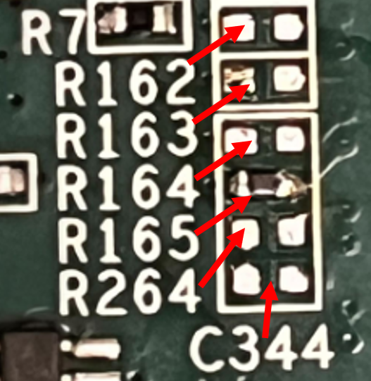

# Simple-Kria-Kv260-Example

Reference application for the SLAC SoC platform on the Xilinx Kria KV260 starter kit (`xck26-sfvc784-2lv-c`).

**Application docs:** https://slaclab.github.io/Simple-Kria-Kv260-Example/

**Shared workflow docs (clone, FW build, Yocto, SD card, Rogue install/launch, remote bitstream update):** https://slaclab.github.io/axi-soc-ultra-plus-core/

## Board-specific deltas

- **Target directory:** `firmware/targets/SimpleKriaKv260Example/`
- **Default DHCP IP convention:** `10.0.0.10` (used in remote-update and GUI launch examples on the docs site)
- **Board:** Xilinx Kria KV260 Vision AI Starter Kit (Kria K26 SOM); FPGA part: `xck26-sfvc784-2lv-c`; firmware version: `v3.3.0.0` (`PRJ_VERSION = 0x03030000`)
- **Conda env (SLAC AFS):** `rogue_v6.9.0`
- **Kria-specific Yocto notes:** Kria Yocto build requires the `-c` clean flag: `./BuildYoctoProject -c -f images/<TargetName>-<PRJ_VERSION>-<timestamp>-<user>-<sha>.xsa`
- **SD boot mode (resistor-based MODE pins):** `MODE3_C2M=R162=open`, `MODE2_C2M=R163=open`, `MODE1_C2M=R164=open (default)`, `MODE0_C2M=R165=499Ω (default)` for `MODE[3:0]_C2M=0b1110`. Reference image:

  
